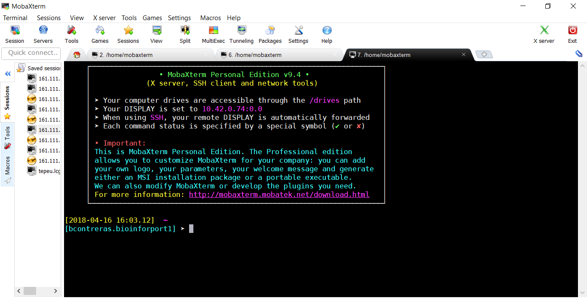

# Session 0: setup

Computer scientists often start counting from zero. In this course, session 0 is about setting up the required environment for the course. Basically, you can use any Linux terminal. Just notice that we are using a user called *osboxes*, which may be different from your username in your system, so that the output of the examples may vary a little.

Therefore, if you already have a Linux terminal available or you want to install Linux as your native OS (either Ubuntu or any other distribution), you may skip this session. Here, we present different ways to install Ubuntu, or other alternative ways to obtain a Linux terminal.

- [Using a virtual machine (VM)](#using-a-virtual-machine--vm-)
- [Ubuntu embedded in Windows 10](#ubuntu-embedded-in-windows-10)
- [Other options](#other-options)

## Using a virtual machine (VM)

A virtual machine allows us to run a different OS (aka *guest OS*) from the one installed as native OS on our computer (aka *host OS*).

There are different virtualization applications. One option to install a VM is:
- Download and install **Oracle VM VirtualBox** (https://www.virtualbox.org/) on your system
- In your web browser, go to https://www.osboxes.org/, **downloads**, and look for **Ubuntu 20.04**
- Once the image for Ubuntu has been downloaded, open VirtualBox
- Within VirtualBox, click on **New**, choose Linux, Ubuntu, and the option to use an existing drive
- Browse and choose the Ubuntu image which you downloaded from osboxes.org
- Follow the wizard to install the Ubuntu OS (default options should be fine)
- Once the process ends, within VirtualBox select the Ubuntu VM and click **Start**

### Changing the keyboard distribution

It is likely that some user will need to change the keyboard distribution. To do this, within the Ubuntu VM, click on the **Show applications** button, type **settings**, and click on the icon. A **Settings** window will emerge, and on the left menu go down to **Region & Language** and click on it. There, below the **Input Sources** section, just click on the **+** icon, then the **...** icon, and look for your language. If you cannot find it, choose **Other**, to see a full list of languages, and search again for yours. Click on your choice, and click **Add**. Then, you should remove other languages, or change priorities moving the one of your choice to the top of the list below the **Input Sources** section.

### Disabling screen saving

Something which could be useful also is disabling shutting down the screen after some inactivity. To do this, go again to *Settings*, on the left menu click on *Power*, and under *Power Saving*, *Blank Screen* choose *Never*.

### Guest Additions

It is recommended also to install the Guest Additions (check if they are already installed, because the *osboxes.org* distribution should have it already), and check the VirtualBox options under the *Devices* menu, to share the clipboard.

### The VirtualBox Host key
Also, it is important to explain how to use the *Host key*. This key can be pressed when within the virtual OS, to recover the keyboard and mouse control for the host OS, and also to activate some options. You can check which is your current *Host key* on the group of icons to the bottom right of the window of the virtual OS. One example of its use, press *Host key+F* to go full screen.

## Ubuntu embedded in Windows 10

For systems runnings Windows 10 there's a way of running Ubuntu and its terminal. Follow these steps:

1. Make sure you have version 1709 or hihger, as explained [here](https://www.protocols.io/view/ubuntu-on-windows-for-computational-biology-sfuebnw)

2. Open Microsoft Store. Search and install "Ubuntu". You can choose a particular version or simply 'Ubuntu' to get the latest supported version.

3. Open system admin and look for "Turn Windows Features on or off". Select the Windows subsystem for Linux.

4. Reboot and launch the Ubuntu app. After a few minutes you should be able to choose your own user and password. You are ready to go.

## Other options 

If you are running a MacOS computer you should be able to run this course on your terminal. You must learn how to install new software though. For instance, you might want to install Xcode Command Line Tools by typing git --version

If you use a Windows system you can install [MobaXterm](https://mobaxterm.mobatek.net). It is a powerfull yet simple tool to connect to SSH and SFTP servers. it also offers Linux terminal and X server. It also allows you to install parts beyond *bash*, such as *git*, *perl* or *python* packages. For example, in order to install Perl under MobaXterm please push "Packages" and select "perl". 

Other options include:

* https://www.vmware.com
* https://www.qemu.org
* https://multipass.run
* https://swcarpentry.github.io/shell-novice/setup.html
